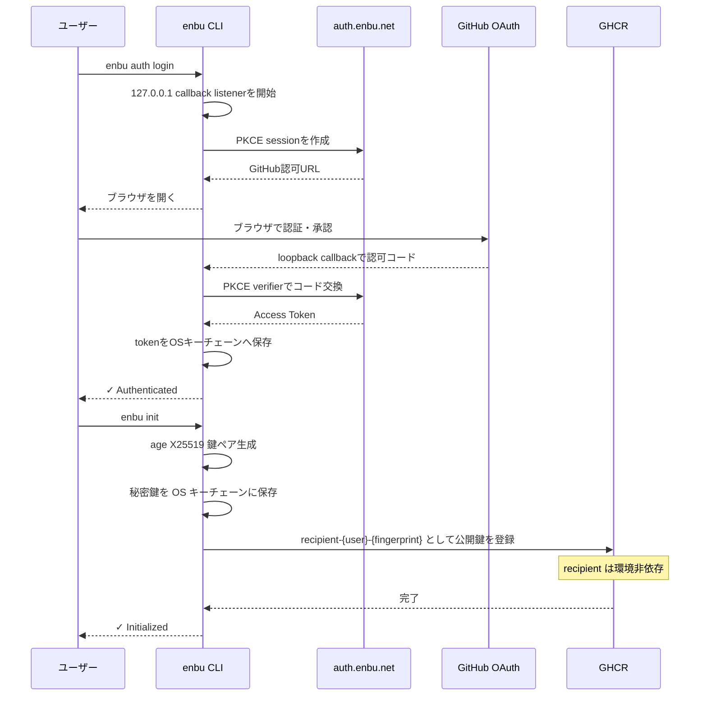
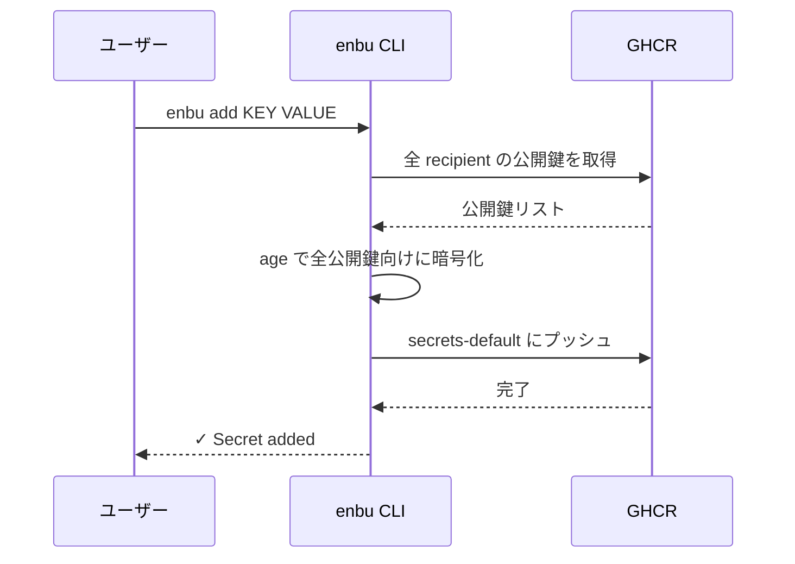
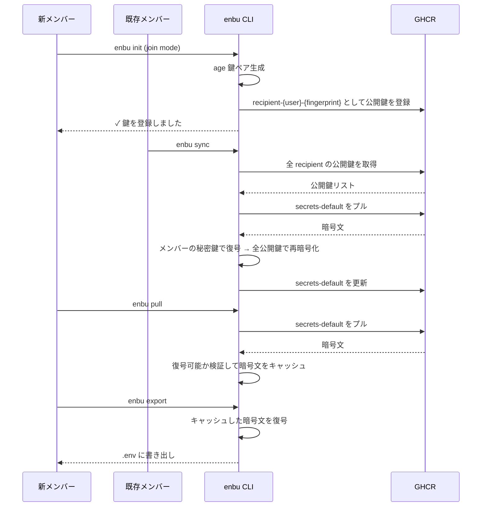

# 💃 enbu

GitHubだけで完結する `.env` 管理ツール  

## なぜ

開発にはAPIキーやDBのパスワードといった機密情報が欠かせないが以下のような問題点がある  

- Slack/Discord/メールはE2EE非対応
    - 「1」「I」「l」のような紛らわしい文字や斜体表示による見間違いがエラーの温床にも
    - 変更のたびに全員へ連絡が必要で負荷が高い
    - 暗号化するにしても
        - 暗号化ファイルを送っても、パスワードや復号鍵の受け渡し経路が安全でない
- 専用品を使えば解決では？
    - 外部サービス利用時のコスト・運用負荷が課題
        - AWS/Google Cloud/1Password等の導入には契約やアカウント管理が必要
        - 運用面・金銭面の両方で組織の大きな負担に
- じゃあGitに含めたらいいじゃん！
    - Git履歴に機密情報の暗号文が永続的に残存
    - 将来的なアルゴリズム脆弱化により、後から解読される危険性

## 特徴

- **GitHubだけで完結** ほかのプラットフォームに依存することなく完結
- **E2E暗号化** 復号できるのは各メンバーのローカル秘密鍵のみ  
- **使いやすいCLI** 暗号文をローカルへ取得し、必要な出力先へ書き出せる  
<!-- 実装中-->
<!--- **機密情報の流出検知・防止** .env等の機密ファイルのcommitやべた書きを防止-->
<!--- **改ざん検知** Sigstoreによる署名と検証により改ざんを検知  -->
<!--- **ポリシー制御** OPA/Regoによるポリシー制御  -->

## インストール

```bash
go install github.com/enbu-net/enbu@latest
```

または [Releases](https://github.com/enbu-net/enbu/releases) からバイナリをダウンロード  

## クイックスタート

### 1. 認証

```bash
enbu auth login
```

GitHubにログインします  
ヘッドレス環境では、`enbu auth login --device`を実行し、表示されたコードをGitHubで入力します。

### 2. リポジトリの初期化

```bash
cd your-repo
enbu init
```

各ユーザーごとにそのリポジトリで1度初期化をします  
以下が自動で行われます  

- X25519鍵ペアの生成
- 秘密鍵をOSキーチェーンに保存
- 公開鍵をGHCRに登録
- `enbu.toml` の作成
- `.gitignore` の更新

### 3. シークレットの追加・編集

```bash
enbu add DATABASE_URL "postgres://..."
enbu add API_KEY "sk-..."
enbu edit API_KEY "sk-new..."

# 環境別シークレット
enbu add --env dev DATABASE_URL "postgres://dev/..."
enbu add --env prod DATABASE_URL "postgres://prod/..."
```

`add` は新規シークレット専用で、同じキーが既にある場合は失敗します。既存シークレットの更新には `edit` を使います。

### 4. シークレットの削除

```bash
enbu delete API_KEY
```

### 5. シークレットの取得と書き出し

```bash
enbu pull                    # ローカルの暗号文キャッシュを更新
enbu export                  # キャッシュを設定済みdotenvファイルへ書き出し
enbu export --env dev        # devのキャッシュを設定済み出力先へ書き出し
enbu export dotenv --stdout  # dotenvを標準出力へ書き出し
```

### 6. メンバーの追加

新しいメンバーがリポジトリ内で `enbu init` を実行すると、joinモードで公開鍵が登録されます。  
既存メンバーがローカルで `enbu sync` を実行すると、そのメンバーも復号可能になります。  

## 環境

`enbu switch` で環境を管理します:

```bash
enbu switch -c dev          # dev を作成して切り替え
enbu switch -c prod         # prod を作成して切り替え
enbu switch dev             # dev に切り替え
enbu switch -               # 前の環境に戻る
enbu switch -l              # 環境一覧
enbu switch -d staging      # 環境を削除
enbu switch -m old new      # 環境をリネーム
```

`enbu.toml` で環境と出力ファイルを定義:

```toml
version = "0.1"
default = "dev"

[env.dev]
output = ".env.dev"

[env.prod]
output = ".env.prod"
```

`add`、`edit`、`delete`、`pull`、`export`、`sync` で `-e`/`--env` を指定すると現在の環境を一時的に上書きします。recipient は全環境で共有され、アクセス制御は sync 時の OPA/Rego ポリシーで行います。`-e` を省略すると `switch` で設定した環境が使われます。

## 鍵の保管

秘密鍵は OS のセキュアストレージに保管されます  

| OS | バックエンド |
|----|-------------|
| macOS | Keychain |
| Linux | Secret Service (GNOME Keyring / KWallet) |
| Windows | Credential Manager |

キーチェーンが利用できない環境（コンテナ、ヘッドレスサーバー等）では、環境変数でフォールバックを指定できます  

```bash
export ENBU_BACKEND=text  # 平文ファイル (0600) で保存
```

pullしたシークレット本体はキーチェーンへ保存されません。age暗号文のままOSのユーザーキャッシュへ保存され、一覧表示またはexport時だけメモリ上で復号されます。

## 仕組み

```
GHCR (ghcr.io/{owner}/{repo}-enbu)
├── recipient-{user}-{fingerprint}      ← 公開鍵（全環境で共有）
├── secrets-default                     ← default 環境の暗号化シークレット
└── secrets-dev                         ← dev 環境の暗号化シークレット
```

1. `enbu add`  - 新規シークレットを全受信者の公開鍵で暗号化し、OCI Imageアーティファクトとしてプッシュ  
2. `enbu edit` - 暗号化された bundle 内の既存シークレットを更新し、更新したアーティファクトをプッシュ  
3. `enbu delete` - 暗号化された bundle からシークレットを削除し、更新したアーティファクトをプッシュ  
4. `enbu pull` - 暗号文をプルし、自分の秘密鍵で検証してローカルの暗号文キャッシュを更新  
5. `enbu export` - キャッシュを復号し、exporterへ渡す。既定のexporterはdotenv  
6. `enbu sync` - メンバー追加・削除時に最新の受信者リストで再暗号化  

### 認証・初期化フロー



### シークレット追加フロー



### メンバー追加・同期フロー


