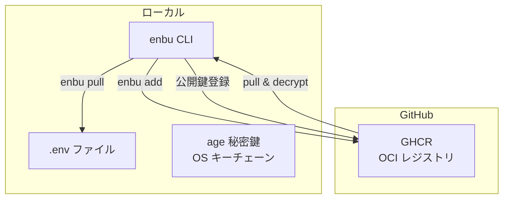
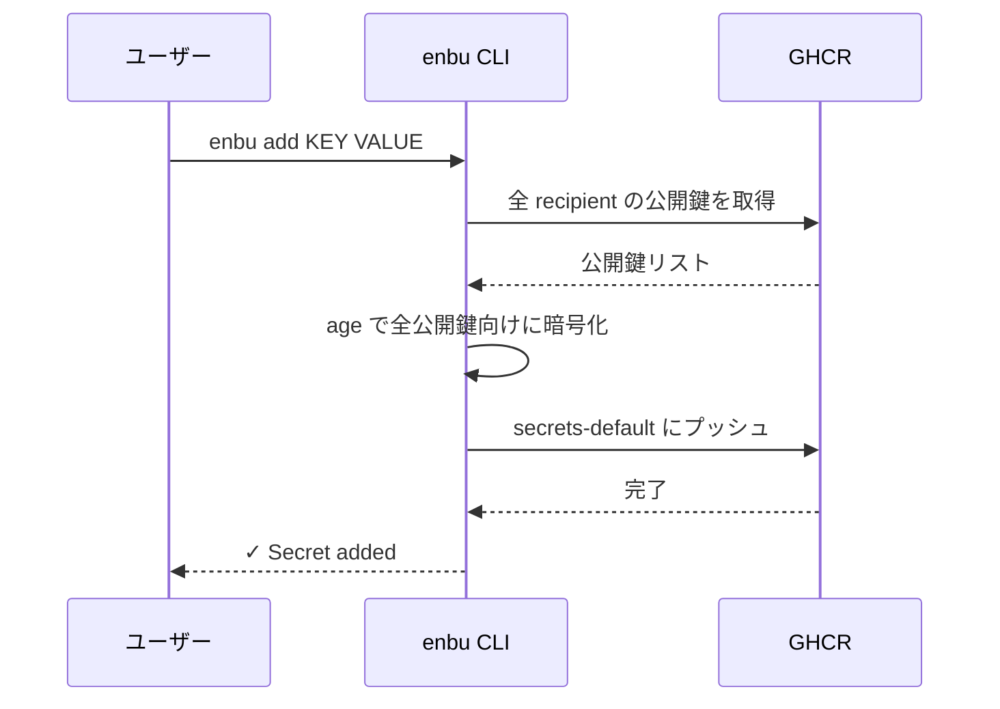
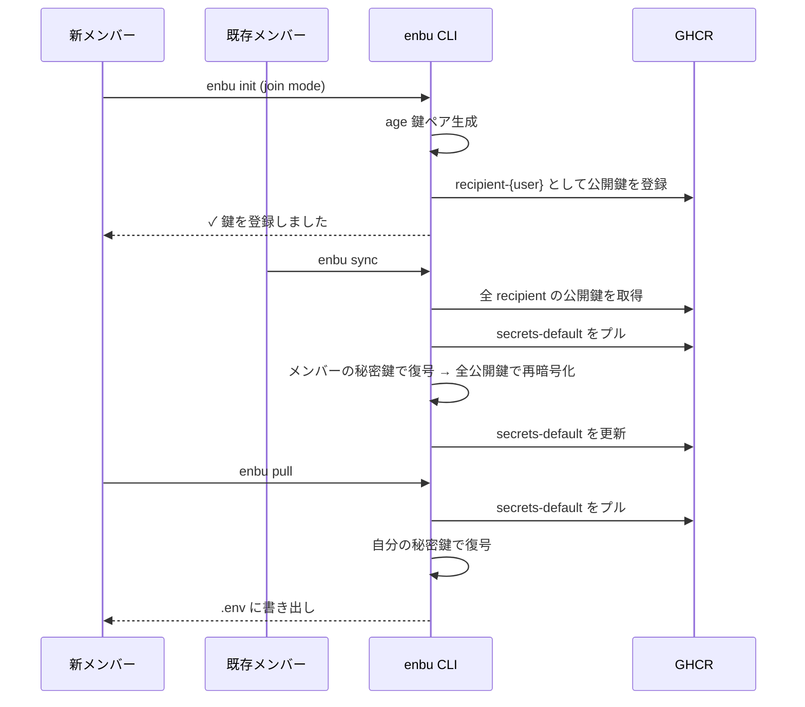

# 💃 enbu

キーレスな `.env` 管理ツール。GitHub をベースに、チームでシークレットを安全に共有できます。

## 特徴

- **キーレス認証** — GitHub Device Flow による OAuth 認証。共有マスターキー不要
- **age 暗号化** — メンバーごとに個別の age X25519 公開鍵で暗号化
- **OCI レジストリ保存** — 暗号文を GHCR に OCI アーティファクトとして保存
- **E2E 暗号化** — 復号できるのは各メンバーのローカル秘密鍵のみ
- **安全な鍵保管** — OS キーチェーン（macOS Keychain / Linux Secret Service / Windows Credential Manager）で秘密鍵を保護
- **楽観的並行制御** — ダイジェストベースの競合検出で安全に同期

## インストール

```bash
go install github.com/yashikota/enbu@latest
```

または [Releases](https://github.com/yashikota/enbu/releases) からバイナリをダウンロード。

## クイックスタート

### 1. 認証

```bash
enbu auth login
```

GitHubにログインします  

### 2. リポジトリの初期化

```bash
cd your-repo
enbu init
```

各ユーザーごとにそのリポジトリで1度初期化をします  
以下が自動で行われます  

- age X25519 鍵ペアの生成
- 秘密鍵を OS キーチェーンに保存
- 公開鍵を GHCR に登録
- `enbu.toml` の作成
- `.gitignore` の更新

### 3. シークレットの追加

```bash
enbu add DATABASE_URL "postgres://..."
enbu add API_KEY "sk-..."
```

### 4. シークレットの取得

```bash
enbu pull # .env ファイルに書き出し
```

### 5. メンバーの追加

新しいメンバーがリポジトリ内で `enbu init` を実行すると、join モードで公開鍵が登録されます。  
既存メンバーがローカルで `enbu sync` を実行すると、そのメンバーも復号可能になります。  

## 鍵の保管

秘密鍵は OS のセキュアストレージに保管されます。

| OS | バックエンド |
|----|-------------|
| macOS | Keychain |
| Linux | Secret Service (GNOME Keyring / KWallet) |
| Windows | Credential Manager |

キーチェーンが利用できない環境（コンテナ、ヘッドレスサーバー等）では、環境変数でフォールバックを指定できます：

```bash
export ENBU_BACKEND=text  # 平文ファイル (0600) で保存
```

## 仕組み

```
GHCR (ghcr.io/{owner}/{repo}-enbu)
├── recipient-{user}-{fingerprint}  ← 全メンバーの公開鍵
└── secrets-default                 ← 暗号化されたシークレット
```

1. `enbu add`  - シークレットを全受信者の公開鍵で暗号化し、OCIアーティファクトとしてプッシュ
2. `enbu pull` - 暗号文をプルし、自分の秘密鍵で復号して `.env` に書き出し
3. `enbu sync` - メンバー追加・削除時に最新の受信者リストで再暗号化

### アーキテクチャ図



### シークレット追加フロー



### メンバー追加・同期フロー


