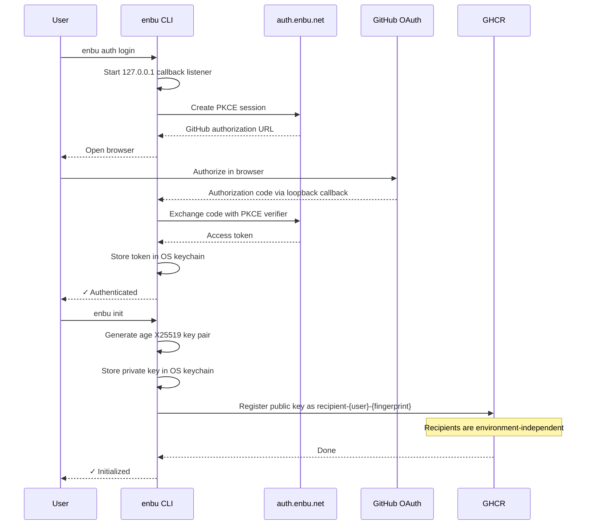
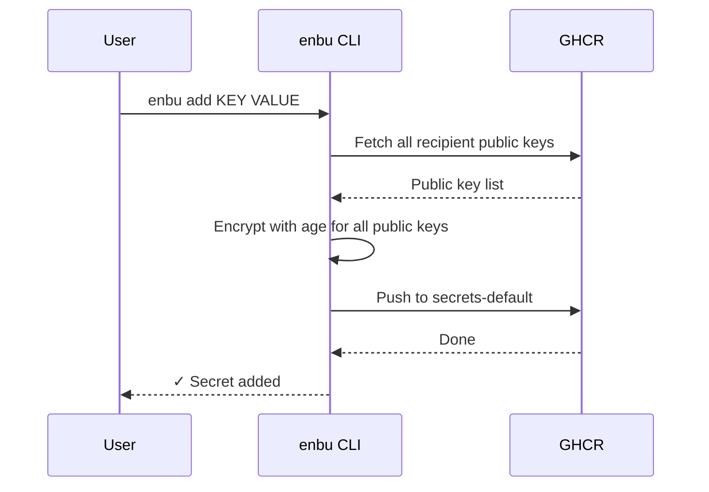
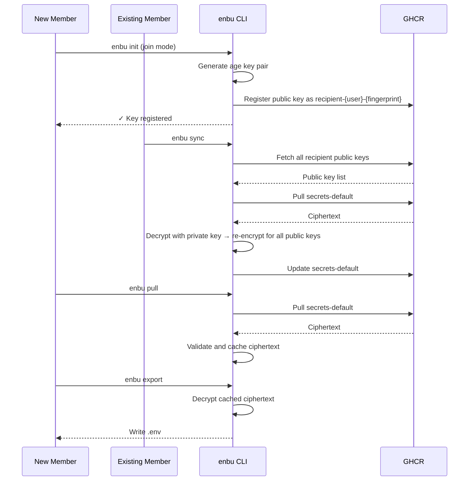

# 💃 enbu

A `.env` management tool that works entirely within GitHub.

## Why

Development requires sensitive information like API keys and database passwords, but existing approaches have problems:

- Slack/Discord/Email lack E2EE
    - Confusing characters like `1`, `I`, `l` and italic rendering cause copy-paste errors
    - Every change requires notifying everyone manually
    - Even if you encrypt: the delivery channel for the password or decryption key is often insecure
- Dedicated secret managers?
    - External services come with cost and operational overhead
        - AWS/Google Cloud/1Password require contracts and account management
        - Significant organizational burden in both cost and operations
- Just commit it to Git!
    - Ciphertext persists permanently in Git history
    - Future algorithm weaknesses could allow retroactive decryption

## Features

- **GitHub-only** — No dependency on external platforms
- **E2E encrypted** — Only each member's local private key can decrypt
- **Simple CLI** — Pull encrypted secrets once, then export them wherever they are needed
<!-- Planned -->
<!--- **Secret leak prevention** — Prevent committing .env files or hardcoded secrets -->
<!--- **Tamper detection** — Sigstore-based signing and verification to detect tampering -->
<!--- **Policy control** — OPA/Rego-based policy enforcement -->

## Install

```bash
go install github.com/enbu-net/enbu@latest
```

Or download a binary from [Releases](https://github.com/enbu-net/enbu/releases).

## Quick Start

### 1. Authenticate

```bash
enbu auth login
```

Log in to GitHub.
For a headless environment, use `enbu auth login --device` and enter the displayed code on GitHub.

### 2. Initialize the repository

```bash
cd your-repo
enbu init
```

Run once per user per repository. This automatically:

- Generates an X25519 key pair
- Stores the private key in the OS keychain
- Registers the public key on GHCR
- Creates `enbu.toml`
- Updates `.gitignore`

### 3. Add or edit secrets

```bash
enbu add DATABASE_URL "postgres://..."
enbu add API_KEY "sk-..."
enbu edit API_KEY "sk-new..."

# Environment-specific secrets
enbu add --env dev DATABASE_URL "postgres://dev/..."
enbu add --env prod DATABASE_URL "postgres://prod/..."
```

`add` creates a new secret and fails if the key already exists. Use `edit` to update an existing secret.

### 4. Delete secrets

```bash
enbu delete API_KEY
```

### 5. Pull and export secrets

```bash
enbu pull                    # Updates the local encrypted cache
enbu export                  # Writes the cache to the configured dotenv file
enbu export --env dev        # Writes the dev cache to its configured output
enbu export dotenv --stdout  # Writes dotenv to stdout
```

### 6. Add a team member

A new member runs `enbu init` inside the repository to enter join mode and register their public key.  
An existing member then runs `enbu sync` locally to re-encrypt secrets for the new recipient.

## Environments

Manage environments with `enbu switch`:

```bash
enbu switch -c dev          # Create and switch to dev
enbu switch -c prod         # Create and switch to prod
enbu switch dev             # Switch to dev
enbu switch -               # Switch back to previous
enbu switch -l              # List environments
enbu switch -d staging      # Delete an environment
enbu switch -m old new      # Rename an environment
```

Define environments in `enbu.toml`:

```toml
version = "0.1"
default = "dev"

[env.dev]
output = ".env.dev"

[env.prod]
output = ".env.prod"
```

Use `-e`/`--env` with `add`, `edit`, `delete`, `pull`, `export`, and `sync` to override the current environment. Recipients are shared across all environments. Per-environment access control is not currently enforced; OPA/Rego policy evaluation at sync time is planned. Without `-e`, enbu uses the environment set by `switch`.

## Key Storage

Private keys are stored in the OS secure storage:

| OS | Backend |
|----|---------|
| macOS | Keychain |
| Linux | Secret Service (GNOME Keyring / KWallet) |
| Windows | Credential Manager |

For environments without a keychain (containers, headless servers), specify a fallback via environment variable:

```bash
export ENBU_BACKEND=text  # Plaintext file (0600 permissions)
```

Pulled secret bundles are not stored in the keychain. They remain age-encrypted at rest in the OS user cache directory. Pull transiently decrypts them in memory to validate the bundle, and listing or export decrypts them in memory when needed.

## How It Works

```
GHCR (ghcr.io/{owner}/{repo}-enbu)
├── recipient-{user}-{fingerprint}      ← Public keys (shared across all environments)
├── secrets-default                     ← Encrypted secrets for default environment
└── secrets-dev                         ← Encrypted secrets for dev environment
```

1. `enbu add` — Creates a new secret, encrypts for all recipients' public keys, and pushes as an OCI image artifact
2. `enbu edit` — Updates an existing secret in the encrypted bundle and pushes the updated artifact
3. `enbu delete` — Removes a secret from the encrypted bundle and pushes the updated artifact
4. `enbu pull` — Pulls ciphertext, validates it with your private key, and updates the local encrypted cache
5. `enbu export` — Decrypts the cache and sends it to an exporter; dotenv is the default exporter
6. `enbu sync` — Re-encrypts with the current recipient list when members are added or removed

### Authentication & Initialization Flow



### Secret Addition Flow



### Member Addition & Sync Flow


