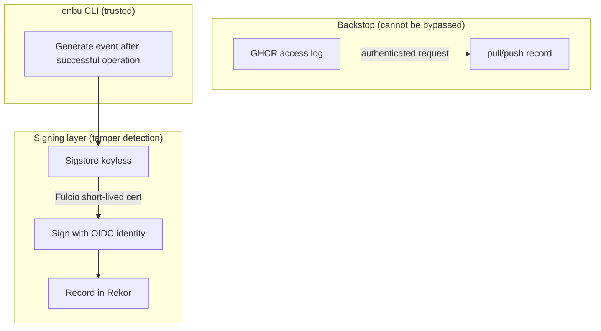
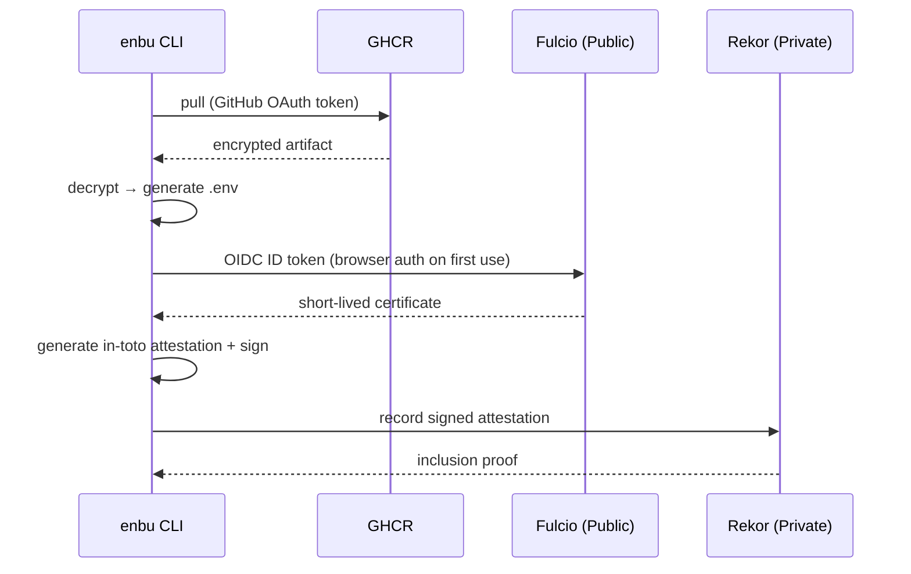

# Audit Design: Operation History Recording and Verification

## Overview

The audit feature records operations on secrets (pull, add, edit, delete, sync, restore) as signed events, providing post-incident traceability and compliance evidence.

The recording infrastructure uses Sigstore (Fulcio + Rekor), consistent with enbu's "keyless" philosophy.

## Goals

In priority order:

1. **Incident investigation**: When a secret leaks, trace "who pulled which secret from which environment, and when"
2. **Compliance**: Produce tamper-proof logs when auditors request evidence (SOC2, ISO27001)
3. **Operational visibility**: Surface unusual access patterns within the team

## Trust Model



### Why trust the client

enbu's trust model, as established in policy.md, assumes that anyone holding a decryption key is trusted.
A modified CLI could skip sending audit events.
However, pull/push operations to GHCR require authenticated requests, and the server records access logs.
These logs cannot be erased by client-side modifications.

Two layers provide protection:

- **enbu audit log** (primary): Rich information (environment, secret names, operation result) with Sigstore signatures. Available as long as the CLI behaves honestly.
- **Registry access log** (backstop): Server-side record of who pulled/pushed which tag and when. Cannot be bypassed by CLI modification.

## Architecture

### Sigstore Stack

| Component | Hosting | Role |
|-----------|---------|------|
| Fulcio | Public Sigstore | Issue short-lived certificates from OIDC ID tokens |
| Rekor | Self-hosted by user organization | Record signed events in a transparency log |

Only the fact that "someone requested a certificate" remains on Public Fulcio.
The audit event content (which environment, which secrets) stays within the Private Rekor instance.

### OIDC Authentication Flow

Normal enbu operations (pull, add, sync, etc.) use the GitHub OAuth access token obtained through the enbu auth broker with Authorization Code Flow and PKCE.
The Fulcio signing request uses an additional OIDC flow via the cosign-go library.



The first invocation opens a browser for OIDC authentication.
Subsequent operations use a refresh token for automatic renewal.
Users do not notice the audit mechanism during normal development.

## Recorded Events

Only operations that touch secret content are recorded.

| Command | Event type | Description |
|---------|-----------|-------------|
| `pull` | `secret.pull` | Retrieve and decrypt secrets |
| `add` | `secret.add` | Add a secret |
| `edit` | `secret.edit` | Update a secret |
| `delete` | `secret.delete` | Delete a secret |
| `sync` | `secret.sync` | Re-encrypt for all recipients |
| `history restore` | `secret.restore` | Restore to a previous version |

Administrative operations (`auth`, `init`, `switch`) are not recorded.
They do not touch secret content and are traceable via Registry access logs.

## Event Format

### in-toto Attestation

Events recorded in Rekor use the in-toto attestation format.

```json
{
  "_type": "https://in-toto.io/Statement/v1",
  "subject": [
    {
      "name": "ghcr.io/owner/repo-enbu:secrets-production",
      "digest": {
        "sha256": "abc123..."
      }
    }
  ],
  "predicateType": "https://enbu.net/provenance/v1",
  "predicate": {
    "event": "secret.pull",
    "environment": "production",
    "actor": {
      "username": "yashikota",
      "id": 12345678
    },
    "secret_names": ["DB_PASSWORD", "API_TOKEN"],
    "result": "success",
    "timestamp": "2026-07-13T14:20:00Z"
  }
}
```

### Subject

The subject contains the OCI Artifact involved in the operation.

- `pull`: digest of the pulled artifact
- Write operations (`add`, `edit`, `delete`, `sync`, `restore`): digest of the newly pushed artifact

The name field includes the full Registry ref (`ghcr.io/owner/repo-enbu:secrets-{env}`), enabling environment-based filtering via the Rekor API.

### Predicate

| Field | Type | Description |
|-------|------|-------------|
| `event` | string | Event type (`secret.pull`, etc.) |
| `environment` | string | Target environment name |
| `actor.username` | string | GitHub username |
| `actor.id` | number | GitHub user ID (immutable, unique) |
| `secret_names` | string[] | Secret names involved (depends on config) |
| `result` | string | `success` or `failure` |
| `timestamp` | string | ISO 8601 timestamp |

Actor authenticity is cryptographically guaranteed by the Fulcio certificate subject.
Forging the predicate content will fail Fulcio signature verification.

### secret_names Protection

The output level for the `secret_names` field is configured in `enbu.toml`.

| Setting | Output | Use case |
|---------|--------|----------|
| `full` (default) | Plaintext secret names | Prioritize immediate incident investigation |
| `minimal` | Secret count only | When secret names themselves are confidential |

Access to the Private Rekor instance is limited to organization members who already know the secret names.
No additional encryption (HMAC, etc.) is applied.

## Configuration

The `[audit]` section in `enbu.toml`:

```toml
[audit]
rekor_url = "https://rekor.internal.example.com"
secret_names = "full"  # full | minimal
```

Audit is enabled only when `rekor_url` is set.
When absent, no audit events are generated or sent.

## Timing and Failure Behavior

Audit events are sent after the operation succeeds.
The goal is to record "what actually happened", not intent.

If sending to Rekor fails, the operation itself is treated as successful and a warning is displayed:

```
Warning: audit event recording failed: connection refused
         The operation completed successfully, but was not recorded in the audit log.
```

Rationale:

- enbu operations require network connectivity to the OCI Registry. If the network is entirely unavailable, the operation itself fails before reaching the audit step.
- When the Registry is reachable but Rekor is down, blocking developer work is disproportionate.
- The Registry access log serves as a backstop even when audit event delivery fails.

## CLI Commands

### `enbu audit list`

Query the Rekor API and display audit events for the current project.

```bash
enbu audit list                                    # all events
enbu audit list --env production                   # filter by environment
enbu audit list --actor yashikota                  # filter by actor
enbu audit list --from 2026-07-01 --to 2026-07-13 # filter by date range
```

### `enbu audit verify`

Verify the Sigstore signature of a specific audit entry.
Used to prove "this log has not been tampered with" during compliance audits.

```bash
enbu audit verify --entry <log-index>
```

Verification steps:

1. Rekor inclusion proof (the entry exists in the transparency log)
2. Fulcio certificate validity (OIDC identity was valid at signing time)
3. Attestation signature correctness (content has not been modified)

## No Local Storage

Audit events are never stored on the local filesystem.

If a workstation is compromised, local audit logs would reveal:

- Which environments were accessed
- Access frequency and patterns
- Secret names

To eliminate this risk, the CLI sends events directly to Rekor after generation and discards them from memory.
Organizations that need search or aggregation query the Rekor API from their own infrastructure.

## Dependencies

| Library | Purpose |
|---------|---------|
| `sigstore/sigstore-go` | Fulcio certificate acquisition, Rekor write, signature verification |
| `sigstore/cosign` (Go) | OIDC flow, keyless signing |

Expected binary size increase: 15–25 MB on top of the current ~13 MB.
This is acceptable for enbu's target users (developers). For reference, kubectl exceeds 50 MB.

## Development Plan

Implemented in full as part of v0.2:

1. Parse `[audit]` section in `enbu.toml`
2. Define audit event model (in-toto attestation)
3. Integrate sigstore-go (Fulcio OIDC + Rekor write)
4. Add audit hooks to target commands (pull, add, edit, delete, sync, restore)
5. Implement `enbu audit list` command
6. Implement `enbu audit verify` command
7. Documentation (Private Rekor setup guide, docker-compose example)

## Design Decisions Summary

| Decision | Choice | Rationale |
|----------|--------|-----------|
| Signing method | Sigstore keyless | Consistent with enbu's "keyless" philosophy. No additional key management |
| Fulcio | Public | Self-hosting Fulcio requires HSM management. Only certificate request facts remain on Public |
| Rekor | Private (self-hosted by org) | Keep audit content internal. enbu only configures the URL |
| Client trust | Trusted | Key holders are trusted by design. Registry logs serve as backstop |
| Recorded events | Secret-touching operations only | Administrative ops are traceable via Registry logs |
| secret_names protection | Rekor access control | Those who can access Rekor already know the secret names |
| Storage | Rekor only | Local storage increases risk upon workstation compromise |
| On send failure | Continue operation, show warning | Do not block developer work |
| Send timing | After successful operation | Record "what actually happened" |
| Binary size increase | Accepted | Within acceptable range for modern CLI tools |

## Future Extensions

- `enbu audit export`: Bulk export for SIEM integration
- Cross-reference report with GitHub Audit Log (Enterprise environments)
- Recording of administrative operations
- Anomaly detection (alerts on unusual access patterns)
