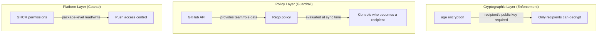
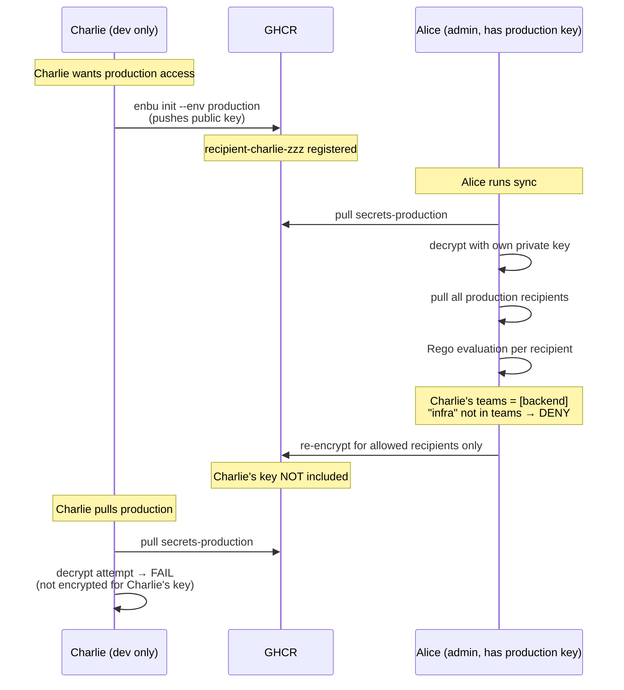
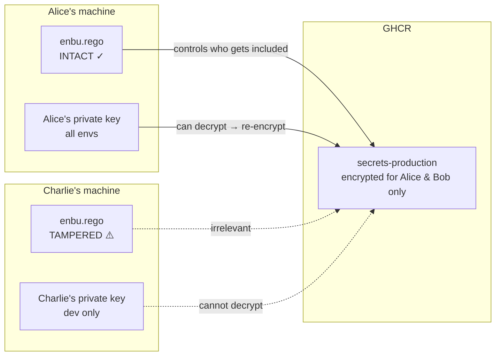
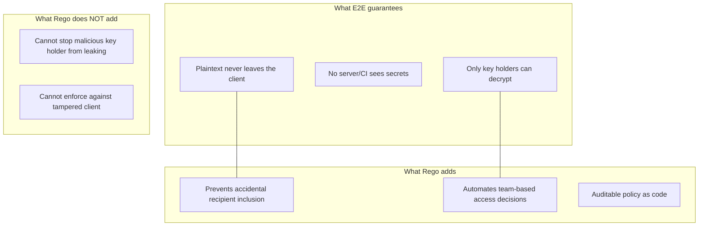
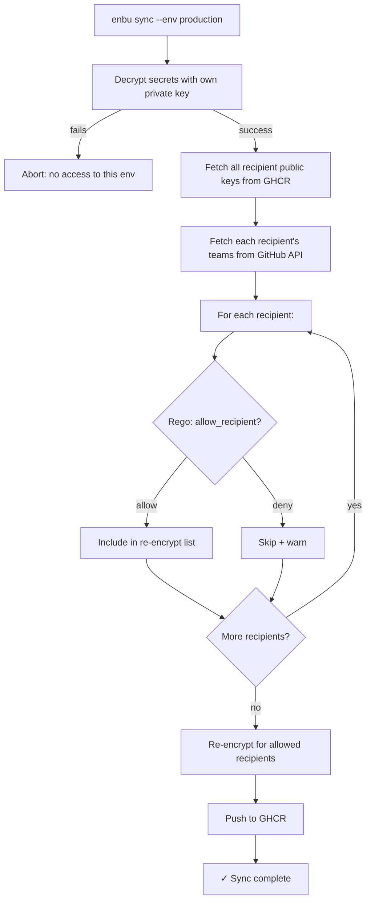

# Policy Design: Environment Access Control

## Overview

enbu uses a layered security model combining **age encryption** (cryptographic enforcement) with **OPA/Rego policies** (operational guardrails) to control per-environment access.

## Trust Model



## Key Insight: Who Evaluates the Policy Matters



## Why Local Rego Tampering Is Not a Threat



| Attacker | Tampers Rego? | Impact |
|----------|---------------|--------|
| Charlie (no production key) | Yes | None. Cannot run `sync --env production` (decryption fails) |
| Alice (has production key) | Yes | She already has plaintext access. Rego tampering adds no new capability |

The policy is evaluated by the **sync executor** — who already holds the decryption key. This means:

- The only person whose Rego matters is someone we **already trust** (they have the private key)
- No additional trust assumptions beyond E2E encryption's inherent model

## End-to-End Encryption Preserved



## Concrete Example

### Team Structure (GitHub)

```
org/infra   → [Alice, Bob]
org/backend → [Alice, Bob, Charlie]
```

### Policy (`enbu.rego`)

```rego
package enbu

import rego.v1

default allow_recipient := false

# dev: everyone
allow_recipient if {
    input.target_env == "dev"
}

# staging: backend or infra team
allow_recipient if {
    input.target_env == "staging"
    "backend" in input.recipient.teams
}

# production: infra team only
allow_recipient if {
    input.target_env == "production"
    "infra" in input.recipient.teams
}
```

### Input (constructed at sync time from GitHub API)

```json
{
  "target_env": "production",
  "recipient": {
    "username": "charlie",
    "teams": ["backend"]
  }
}
```

### Result Matrix

| Person | dev | staging | production |
|--------|-----|---------|------------|
| Alice (infra, backend) | ✓ | ✓ | ✓ |
| Bob (infra, backend) | ✓ | ✓ | ✓ |
| Charlie (backend) | ✓ | ✓ | ✗ |

## Sync Flow with Policy Evaluation



## Security Properties Summary

| Property | Mechanism | Strength |
|----------|-----------|----------|
| Unauthorized read | age encryption | Cryptographic (strong) |
| Unauthorized recipient addition | Rego policy at sync time | Operational (guardrail) |
| Sync executor trust | Inherent to E2E model | Assumed |
| Policy data integrity | GitHub API as source of truth | Platform trust |
| Policy rule integrity | Sync executor's local file | Trusted (same as key holder) |

## Policy Input: What enbu Provides to Rego

enbu constructs the Rego input from GitHub API at sync time. The input contains all available information — policy authors choose which fields to use.

### Input Schema

```json
{
  "target_env": "production",
  "recipient": {
    "username": "charlie",
    "teams": ["backend", "frontend"],
    "permission": "write"
  },
  "repo": {
    "owner": "alice",
    "name": "myapp",
    "is_org": true
  }
}
```

| Field | Source | Available |
|-------|--------|-----------|
| `recipient.username` | GHCR recipient tag | Always |
| `recipient.teams` | `GET /orgs/{org}/teams/{team}/members` | Org repos only |
| `recipient.permission` | `GET /repos/{owner}/{repo}/collaborators/{user}/permission` | Always |
| `repo.is_org` | `GET /users/{owner}` | Always |

### Policy Patterns by Repository Type

#### Organization Repository (teams available)

```rego
package enbu

import rego.v1

default allow_recipient := false

allow_recipient if {
    input.target_env == "dev"
}

allow_recipient if {
    input.target_env == "production"
    "infra" in input.recipient.teams
}
```

#### Personal Repository (no teams — use permission or username)

```rego
package enbu

import rego.v1

default allow_recipient := false

# dev: anyone with write access
allow_recipient if {
    input.target_env == "dev"
    input.recipient.permission in ["admin", "write"]
}

# production: admin only
allow_recipient if {
    input.target_env == "production"
    input.recipient.permission == "admin"
}

# production: or explicitly named users
allow_recipient if {
    input.target_env == "production"
    input.recipient.username in ["alice", "bob"]
}
```

#### Hybrid (combine multiple conditions)

```rego
package enbu

import rego.v1

default allow_recipient := false

# staging: write permission AND backend team
allow_recipient if {
    input.target_env == "staging"
    input.recipient.permission in ["admin", "write"]
    "backend" in input.recipient.teams
}

# production: specific users regardless of team
allow_recipient if {
    input.target_env == "production"
    input.recipient.username in ["alice"]
}
```

### Summary

enbu provides all GitHub-derived facts as input. Rego decides the logic. This means:

- **Org repos** → use `teams` for scalable group-based access
- **Personal repos** → use `permission` (admin/write/read) or `username` for explicit control
- **Mixed** → combine freely; Rego is expressive enough to handle any combination

enbu does not dictate which fields to use — policy authors choose the appropriate pattern for their setup.

## Design Decisions

1. **E2E encryption is non-negotiable** — no server or CI ever sees plaintext
2. **`init` is permissionless** — anyone can register a public key for any environment
3. **`sync` is the gate** — policy evaluation happens here, controlled by key holders
4. **GitHub API is the identity provider** — team membership is the policy input, not locally-defined roles
5. **Rego is a guardrail, not a fence** — protects against mistakes by trusted users, not against malicious insiders (who already have plaintext access)
6. **Single GHCR package** — environment isolation is cryptographic, not permission-based
